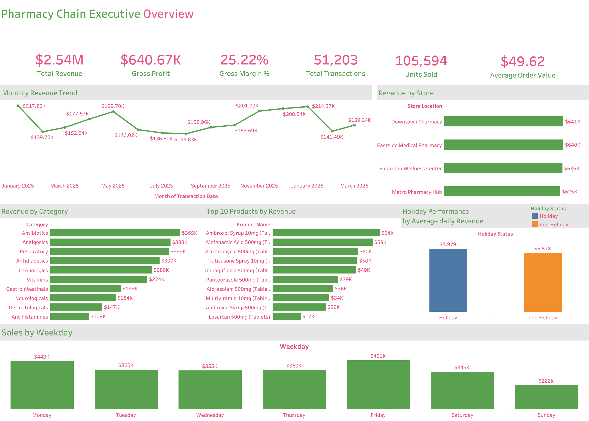

# Pharmacy Chain Analysis

> End-to-end MySQL data cleaning and analysis project with an interactive Tableau Executive Overview dashboard.

## Project Overview

This end-to-end data analysis project examines the sales, customers, products, and inventory of a pharmacy chain using MySQL and Tableau. The SQL workflow transforms raw CSV files into a clean relational model, while the interactive Tableau dashboard presents the main commercial and operational findings for decision-makers.

## Project Links

- [View the interactive dashboard on Tableau Public](https://public.tableau.com/views/PharmacyChainExecutiveOverview/ExecutiveOverview?:language=en-US&publish=yes&:sid=&:display_count=n&:origin=viz_share_link)
- [Download the Tableau Workbook](https://github.com/abdelazizsabry7/pharmacy-chain-analysis/raw/refs/heads/main/Pharmacy_Chain_Eecutive_Overview.twbx)
- [SQL analysis](pharmacy_chain_analysis.sql)

## Dashboard Preview

[](https://public.tableau.com/views/PharmacyChainExecutiveOverview/ExecutiveOverview?:language=en-US&publish=yes&:sid=&:display_count=n&:origin=viz_share_link)

Click the dashboard image to open the interactive version on Tableau Public.

The main objective is to turn raw pharmacy data into reliable business insights that can support decisions such as:

- Which products, categories, and stores generate the most revenue and profit?
- Who are the most valuable and frequent customers?
- How do holiday and non-holiday sales compare?
- Which products are at risk of stockout?
- Which products may be overstocked?
- Which high-profit products should receive the highest reorder priority?

## Tools and Technologies

- MySQL 8.0+
- MySQL Workbench
- Tableau Public
- Data visualization and dashboard design
- SQL concepts used:
  - Common Table Expressions (CTEs)
  - Window functions
  - Aggregate functions
  - Conditional logic with `CASE`
  - Views
  - Primary and foreign keys
  - Data type conversion
  - Data-quality validation

## Dataset Structure

The project uses four source datasets:

- `customers`: customer details, demographics, registration date, and registered store.
- `products`: product names, categories, cost prices, and retail prices.
- `inventory`: current stock, reorder level, safety stock, supplier lead time, and average daily sales.
- `transactions`: transaction date, customer, product, quantity, unit price, store, and holiday status.

Raw data is first imported into the following staging tables:

- `stg_customers`
- `stg_products`
- `stg_inventory`
- `stg_transactions`

After cleaning, the final analytical model contains:

- `stores`
- `customers`
- `products`
- `inventory`
- `transactions`
- `rejected_transactions`

## Project Workflow

The project is divided into two connected parts:

- **SQL:** data profiling, cleaning, modeling, validation, and business analysis.
- **Tableau:** KPI reporting and interactive visual analysis using the cleaned data.

## SQL Analysis

### 1. Raw Staging Layer

The four staging tables are created using text-based data types. This preserves blank, malformed, and inconsistent values during import so they can be inspected and handled in SQL instead of being silently lost or converted.

### 2. Data Profiling

The profiling section checks:

- Imported row counts
- Missing customer and transaction fields
- Duplicate transaction IDs
- Exact and conflicting duplicates
- Quantity distribution and possible outliers
- Invalid product references
- Invalid customer references

### 3. Data Cleaning and Rejection Layer

The cleaning process:

- Adds a unique identifier to every raw transaction row
- Classifies duplicate records
- Keeps the first valid version of exact duplicates
- Rejects conflicting duplicates
- Rejects rows with missing or malformed critical fields
- Rejects invalid customer and product references
- Rejects nonpositive quantities and prices
- Stores rejected rows and their rejection reasons in `rejected_transactions`
- Preserves the raw staging data instead of deleting problematic records

### 4. Final Analytical Data Model

Clean dimension and fact tables are created with suitable data types, primary keys, and foreign-key relationships. The final `transactions` table also contains a generated `sales_amount` value based on quantity and unit price.

The final tables must be dropped in child-to-parent order when the model is rebuilt:

```sql
DROP TABLE IF EXISTS transactions;
DROP TABLE IF EXISTS inventory;
DROP TABLE IF EXISTS customers;
DROP TABLE IF EXISTS products;
DROP TABLE IF EXISTS stores;
```

### 5. Final Data Validation

The validation section confirms:

- Final table row counts
- Reconciliation of accepted and rejected transactions
- Unique transaction IDs
- Completeness of critical fields
- Valid quantity, price, and sales ranges
- Referential integrity between final tables

### 6. Exploratory Data Analysis

The analysis contains 32 business-focused queries covering:

- Analysis period and distinct sales days
- Revenue, transactions, units sold, and average order value
- Gross profit and gross margin
- Monthly trends and month-over-month revenue growth
- Month, weekday, store, category, and product rankings
- Products sold below their listed retail price
- Top customers and customer purchase frequency
- Customer value, age-group, and gender analysis
- Customer loyalty to the registered store
- Holiday versus non-holiday performance
- Average daily holiday performance
- Reorder-level and stockout-risk analysis
- Inventory cover days and supplier lead-time demand
- Unit shortage and reorder priority
- Product and category inventory value
- Possible overstocked products
- High-profit products currently at stockout risk

## Tableau Dashboard

The Tableau component converts the cleaned SQL output into an interactive Executive Overview designed for fast performance monitoring. The dashboard summarizes sales and profitability, reveals time-based patterns, compares store and category performance, and highlights the products generating the most revenue.

### Tableau Data Preparation

The dashboard data source was created from the cleaned final SQL tables rather than the raw staging tables. Transaction records were enriched with product, customer, and store attributes to create an analysis-ready dataset at transaction level.

Before visualization, the Tableau data source was checked to confirm that:

- `Transaction Date` was recognized as a date.
- IDs and descriptive attributes were treated as dimensions.
- Quantity, revenue, cost, and profit fields were treated as measures.
- The number of imported rows matched the clean transaction count in MySQL.
- Revenue and profit totals matched the validated SQL results.
- Inventory snapshot values were excluded from the Executive Overview dataset to avoid repeating product-level stock values across transaction rows.

### Executive KPI Cards

- **Total Revenue:** `$2.54M`
- **Gross Profit:** `$640.67K`
- **Gross Margin:** `25.22%`
- **Total Transactions:** `51,203`
- **Units Sold:** `105,594`
- **Average Order Value:** `$49.62`

The KPI cards provide an immediate summary of the pharmacy chain's overall commercial performance.

### Tableau Calculated Fields

The following calculations were created in Tableau and checked against their SQL equivalents:

```text
Gross Margin %
= SUM([Gross Profit]) / SUM([Sales Amount])

Total Transactions
= COUNTD([Transaction Id])

Average Order Value
= SUM([Sales Amount]) / COUNTD([Transaction Id])

Average Daily Revenue
= SUM([Sales Amount]) / COUNTD([Transaction Date])

Holiday Status
= IF [Is Holiday] = 1 THEN "Holiday" ELSE "Non-Holiday" END
```

Aggregate calculations were used instead of averaging row-level percentages, ensuring that large and small transactions were weighted correctly.

### Dashboard Visuals

- **Monthly Revenue Trend:** a continuous line chart covering January 2025 through March 2026.
- **Revenue by Store:** a sorted horizontal bar chart comparing the four pharmacy locations.
- **Revenue by Category:** a descending bar chart identifying the strongest therapeutic categories.
- **Top 10 Products by Revenue:** a product ranking focused on the largest revenue contributors.
- **Sales by Weekday:** a weekday comparison used to identify high- and low-demand days.
- **Holiday Performance:** a comparison based on average daily revenue rather than total revenue, avoiding bias from unequal numbers of holiday and non-holiday dates.

### Dashboard Interactivity

- Hover tooltips provide revenue, profit, transaction, and unit details without overcrowding the charts.
- Marks can be selected to inspect individual months, stores, categories, products, and weekdays.
- The published Tableau view allows users to explore the dashboard in full-screen mode.

### Dashboard Design

- KPI cards are positioned at the top for rapid executive-level scanning.
- Consistent green and pink colors establish a clear visual hierarchy across the dashboard.
- Horizontal bars improve readability for long store, category, and product names.
- Revenue labels use abbreviated `K` and `M` units to reduce visual clutter.
- Chart titles use shaded backgrounds to separate the dashboard into clear analytical sections.
- A single dashboard layout keeps the most important sales views accessible without navigating between pages.

## Key Dashboard Insights

- The pharmacy chain generated approximately **$2.54M in revenue** and **$640.67K in gross profit**, resulting in a **25.22% gross margin**.
- The four stores performed relatively closely, with **Downtown Pharmacy** leading at approximately **$641K** in revenue.
- Monthly revenue peaked in **January 2025** at approximately **$217.26K**, while **August 2025** recorded the lowest monthly value at approximately **$133.83K**.
- **Antibiotics** was the highest-revenue product category at approximately **$365K**.
- **Ambroxol Syrup 10mg** was the leading product in the Top 10 ranking at approximately **$64K** in revenue.
- **Friday** generated the highest weekday revenue at approximately **$451K**, while **Sunday** generated the lowest at approximately **$222K**.
- Average daily holiday revenue was approximately **$5,979**, compared with **$5,578** on non-holidays, making holiday daily revenue about **7.2% higher**.

## Key Business Metrics

The project calculates several important metrics:

```text
Sales Amount = Quantity × Unit Price

Gross Profit = Quantity × (Unit Price − Cost Price)

Gross Margin % = Gross Profit ÷ Revenue × 100

Inventory Cover Days = Current Stock ÷ Average Daily Sales

Lead-Time Demand = Average Daily Sales × Lead-Time Days

Required Stock = Lead-Time Demand + Safety Stock

Stock Shortage = Required Stock − Current Stock
```

`NULLIF()` is used in division calculations to prevent division-by-zero errors.

## How to Run the Project

### Run the SQL Workflow

1. Open `pharmacy_chain_analysis.sql` in MySQL Workbench.
2. Run Section 1 to create the database and staging tables.
3. Import each CSV file into its matching staging table.
4. Run Section 2 to profile the imported data.
5. Run Sections 3 and 4 to clean the data and build the final model.
6. Run Section 5 to validate the final data.
7. Run Section 6 to generate the analytical results.

Do not run the entire script before importing the CSV files. The staging tables must contain the raw data before the cleaning and loading sections are executed.

When running the prepared-statement block that adds `staging_row_id`, select and execute the complete block from the first `SET` statement through `DEALLOCATE PREPARE`. Executing only the final line can produce an unknown prepared-statement error.

### Open the Tableau Dashboard

1. Open the [interactive Pharmacy Chain Executive Overview](https://public.tableau.com/views/PharmacyChainExecutiveOverview/ExecutiveOverview?:language=en-US&publish=yes&:sid=&:display_count=n&:origin=viz_share_link).
2. Hover over chart marks to view detailed KPI tooltips.
3. Select individual marks to inspect specific months, stores, categories, products, or weekdays.

To inspect the dashboard locally, download [`Pharmacy_Chain_Eecutive_Overview.twbx`](Pharmacy_Chain_Eecutive_Overview.twbx) and open it using Tableau Public or Tableau Desktop.

## Repository Files

- `pharmacy_chain_analysis.sql`: the complete MySQL workflow, including staging, profiling, cleaning, validation, and exploratory analysis.
- `README.md`: project documentation, methodology, metrics, and usage instructions.
- `Pharmacy_Chain_Eecutive_Overview.twbx`: packaged Tableau workbook containing the dashboard and its extract.
- `Executive_Overview.png`: dashboard preview displayed in this README.

## Project Outcome

The project produces a clean and validated relational dataset, a set of decision-oriented SQL analyses, and an interactive Tableau dashboard. The analysis connects revenue and profitability with customer, store, product, and inventory performance, helping the pharmacy chain identify growth opportunities and prioritize replenishment decisions.
